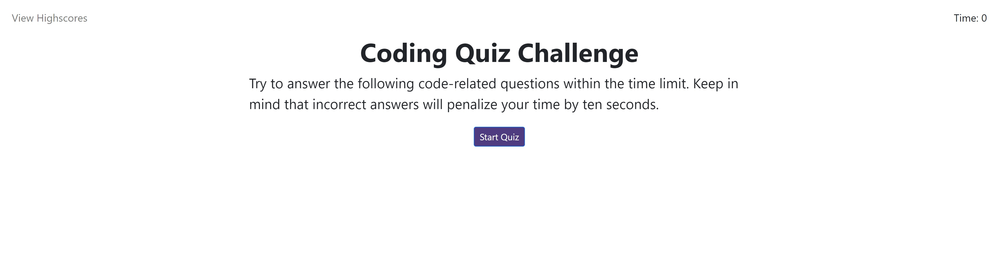

# Coding Quiz

## Description

A timed quiz that allows users to test their coding knowledge. The quiz will also store the users high scores.

## Usage

To use the quiz, go to the website at https://owenlang05.github.io/Coding-Quiz/

## Credits

APIs used: JQuery, Bootstrap

## License

Refer to the repo

## Features

Interesting Coding Questions, A Highscore board, and a punishment for answering wrong.